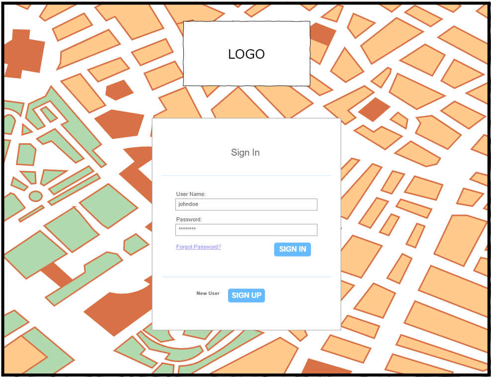
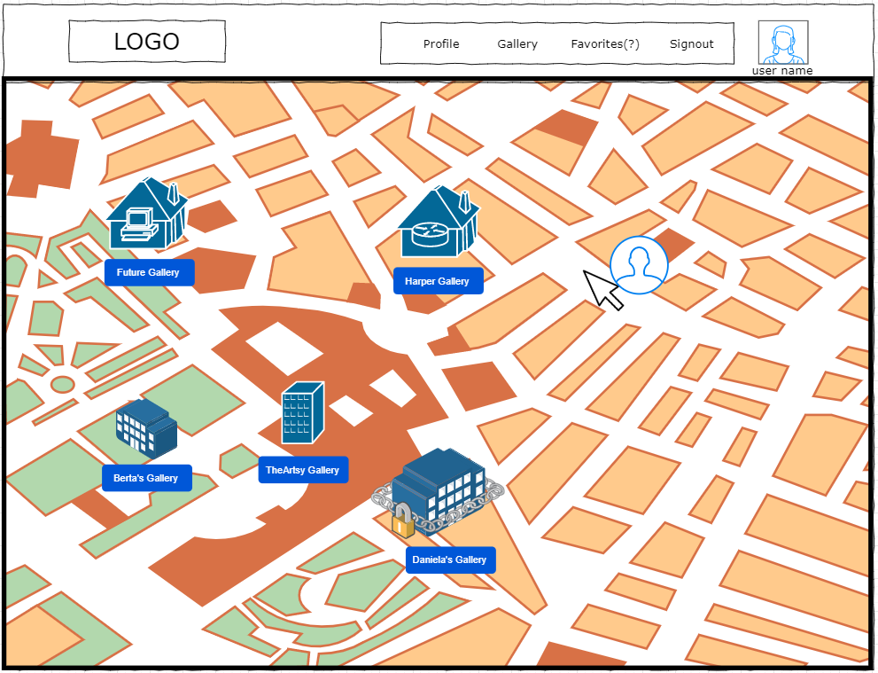
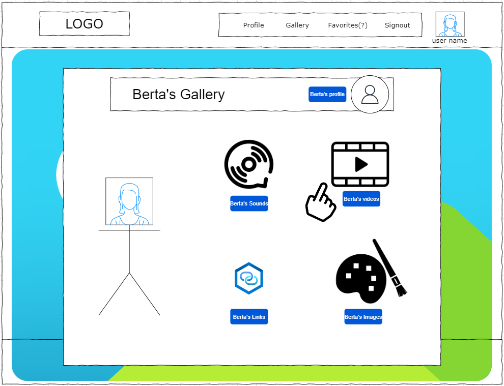
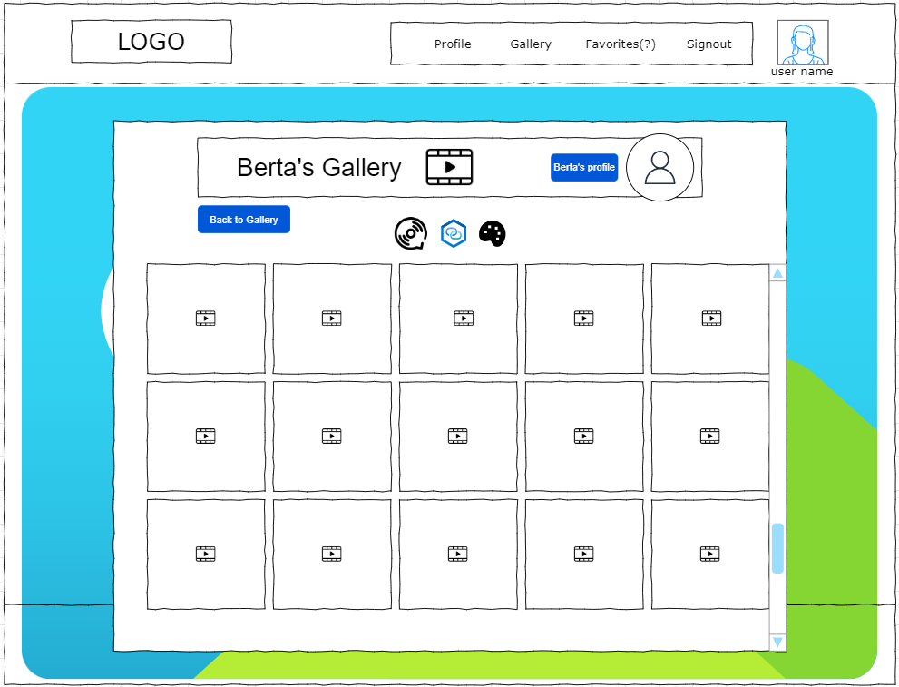
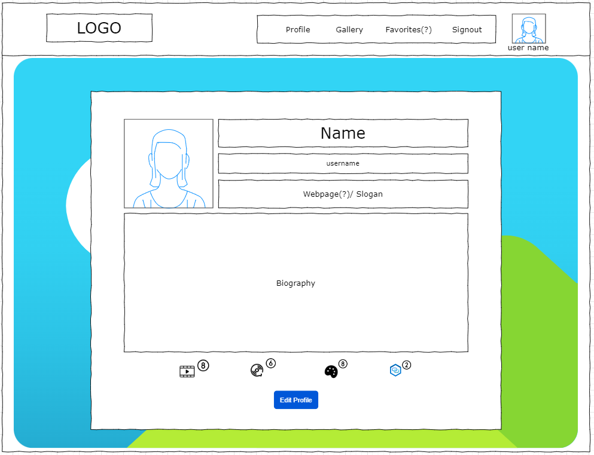
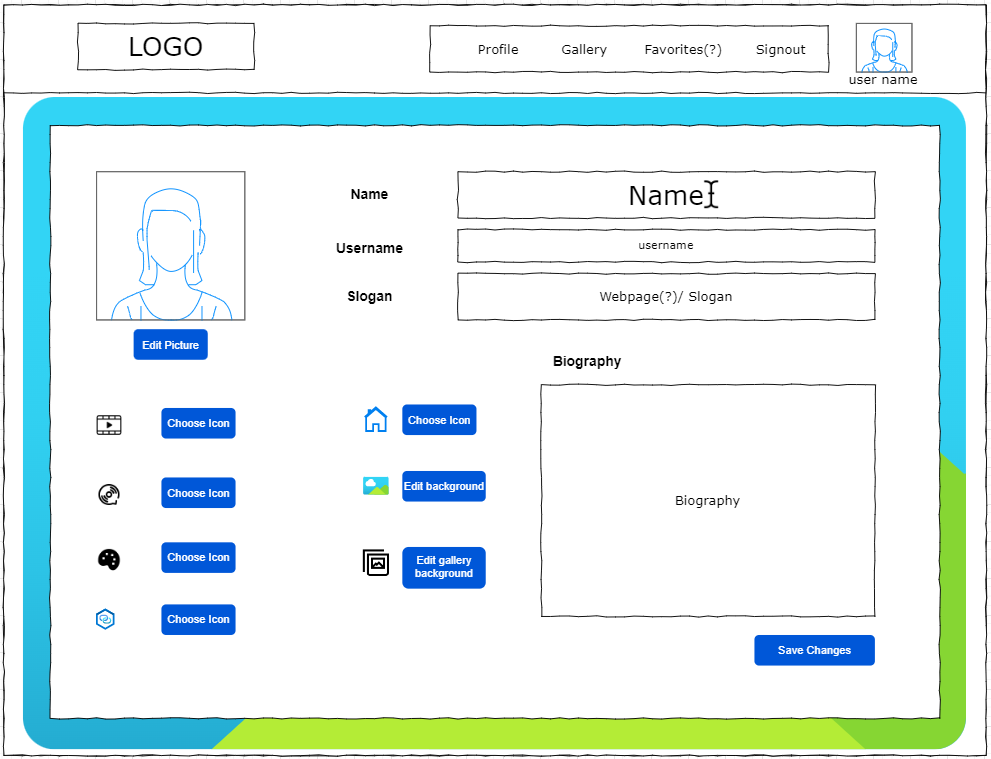
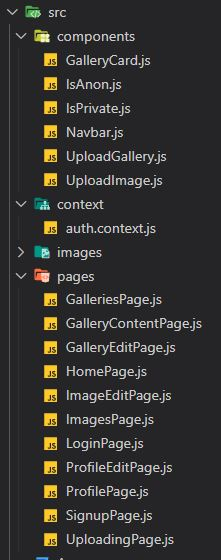

# WelComeIn

This project was based on the classic Web Applications which are Habbo, SoundCloud and Instagram, 
in an attem to create a hybrid between them which could satisfy the need of personalisation and display of media. 
 

<h3>Wireframes</h3>
Based on the following: 
 

<h3>Technologies Used</h3>
The most remarkable technologies used were: 
 
- React and it's libraries as npm, npx, axios, etc
- Node
- We developed on Visual Studio Code

<h3>Components and Pages structure</h3>
The file stucture: 
 

<h3>Future Work</h3>

I'd love to continue implementing the some spare paths and the features I originally planned for.
  

<h3>Resources</h3>
https://docs.google.com/presentation/d/1Sa5HAKu_9zviqFj1D0mh1ITU_0e9HStveE0-hwylC6I/edit?usp=sharing

https://trello.com/b/zV3PBHqc/welcomein-final-project